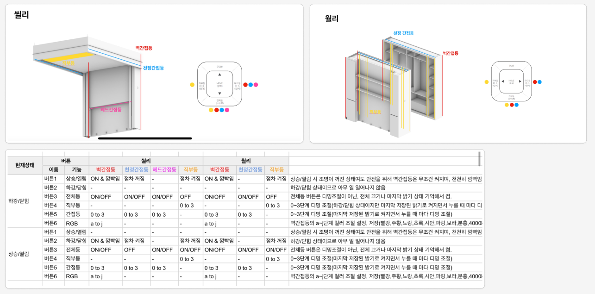

# User manual

사용자가 Ceily와 인터렉션 하는 부분을 설명한다.
빨간색으로 표시된 항목은 아직 구현되지 않은 부분이다.

## 모션 제어
### 기본 동작 제어
1. 조작 버튼 또는 앱(ble)을 통해 위/아래로 Ceily가 제어 가능해야 한다.
1. 위/아래 버튼을 누르면 해당 방향으로 움직이며, 어떤 방향으로든 한번 더 누르면 멈춘다.
1. 동작 시작시 S-Curve로 가속하며 3000ms내 정속 구간으로 이동한다.
1. 동작 중 양 끝 Limit 센서를 만나면 S-Curve로 감속하여 500ms내에 정지한다.
2. 침대의 이동속도는 100mm/sec로 고정한다.
3. 동작이 끝나고 속도가 0이 되면 모터를 Disable하여 사용자가 수동으로 움직일 수 있도록 한다.

### 긴급 정지
1. 토크, ToF 센서를 통해 외부 장애 요소가 인식되는 경우 긴급 정지(속도를 0으로 변경)한다.
2. E-Stop 스위치가 눌리면 긴급 정지한다.

## 다리 제어
1. 침대가 위로 움직이면서 다리는 0도로 접힌다.
2. 침대가 아래로 움직이면서 다리는 90도로 펴진다.
3. 다리가 0~90도 사이에 위치하는 한 1,2 번이 지켜져야 한다. ex) 30도에서 시작 하는 경우
4. 속도는 15도/sec로 제어한다 (?): 90도를 6초에

## 안전 제어
### 올림 동작시
1. 올림 동작 시작 후 2초 내에 침대 위에 2kg 이상의 하중을 토크 이상 여부를 통해 판별하고 멈춘다.
2. 올림 동작 중 외부요인으로 인한 충격이 감지되면, 동작을 멈추고 긴급 정지한다.

### 내림 동작시
1. 내림 동작 시작 시점에서 ToF를 통해 침대 밑 장애물을 감지하고, 있을 시 동작하지 않는다.
2. 내림 동작 중 토크 감지를 통해 충격이 감지되면 긴급 정지한다.
3. ToF 센서가 연결되지 않았거나 동작하지 않으면, 하강하지 않는다.

### 올림/내림 공통
1. 보드와 모터의 연결이 끊어지는 경우 긴급 정지 한다.

## LED 제어
### 버튼 제어

### 동작 중 제어

### BLE 제어

## 알림
아래 요소에 대해 알림을 제공한다.

1. 동작의 시작/멈춤 이벤트와 명령의 주체
2. 동작 중 이상이 감지되었을 때 에러코드

## 상태 정보 표시
1. 기기의 상태 정보를 내보낸다.

# Internal manual
## 시리얼 번호
1. 각 장치별 고유 8자리 시리얼 번호를 갖는다.

## ble 통신 속도
1. Ex) device status를 읽어 들이는 통신을 100ms 마다 통신한다.
2. 통신 관련 파라미터는 아래와 같다.

## 토크 학습 기능
1. 환경에 맞는 토크값을 학습할 수 있는 기능을 제공한다.
2. 학습한 결과를 저장할 수 있는 기능을 제공한다.
3. 학습한 결과를 초기화 할 수 있는 기능을 제공한다.

## 장치의 치수
1. 장치의 치수를 확인/설정할 수 있는 프로파일을 제공한다.
2. 장치의 치수가 설정되지 않았다면 동작하지 않는다.

## 장비 상태
1. 장비의 상태를 확인 할 수 있는 프로파일을 제공한다.
2. 장비의 상태가 정상이 아니라면 동작하지 않는다.

## 다리의 상태
1. 다리의 상태와 위치를 확인 할 수 있는 프로파일을 제공한다.

# Device setup

## 장비 연결
1. 장비를 설치한다.
2. 장비를 켠다.
3. 작업자 앱을 통해 장비와 연결한다.
4. Admin 설정 시작 명령을 보낸다.
   1. Admin 설정 완료 flag가 없으면 장비가 동작하지 않음

## 장비 타입 설정
1. Admin 설정 중임을 확인한다.
1. 작업자 앱에서 장비의 타입 및 치수를 설정한다.
   1. 타입: 가로/세로 타입
   2. 치수
      1. 침대 너비
      2. 침대 길이
2. 장비 타입 및 치수를 설정 완료한 후 저장한다.

## 캘리브레이션 진행
1. 장비를 제일 아래까지 손으로 내린다.
   1. Ceily의 위치가 0으로 설정된다.
2. 캘리브레이션 진행 버튼을 누른다.
3. 캘리브레이션이 완료된 후 저장 버튼을 누른다.

## 캘리브레이션 과정
1. Down 리밋이 걸려 있는지 확인한다.
2. Up으로 이동한다.
   1. Limit이 걸리면: Stroke를 저장한다.
   2. Limit이 걸리지 않은채 멈추면: 캘리브레이션을 일시중지한다.
3. Down으로 이동한다.
4. 토크 모델의 학습률이 100%가 될 때까지 Up-Down을 반복한다.
5. 토크 모델이 모두 학습되었으면 저장하고, 캘리브레이션을 종료한다.
6. 캘리브레이션 결과를 작업자에게 알린다.

