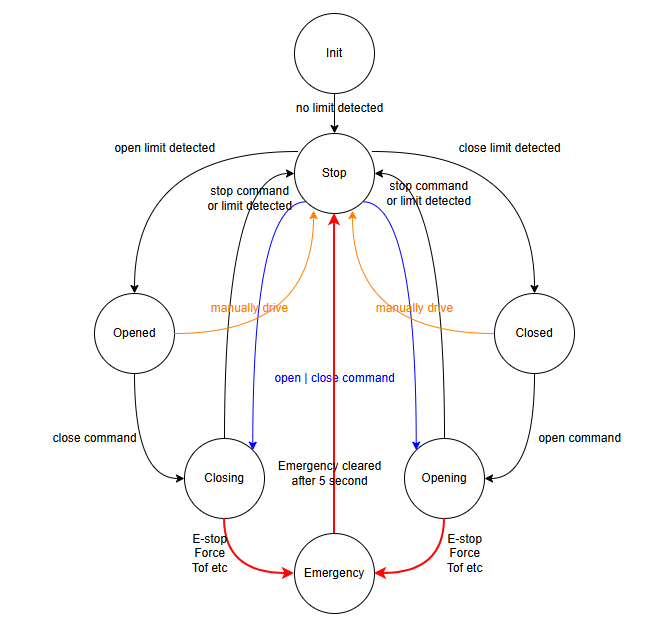

# 6월 방향성

버그 수정 및 안전성 향상 100% 기능 구현에 초점을 맞춘다.

이 후 리펙토링을 통해 코드 안정성을 높여 간다.

이를 위해 버그, 안정성 향상, 구현되지 않은 기능에 대해 정리하고 우선순위를 파악한다.

## Wally

### 5.23 Target: Wally
- State pattern 적용

- LED 시나리오 다시 리뷰하기
- Wally 모션에 따라 LED 제어하기
- Emergency state 추가하기
- Device manager motion controller로 부터 분리하기
- Limit sensor 만날 때 마다 위치 업데이트 하기
- SystemInfo common 적용 및 wally 시리얼 번호 적용
- 로그 내보내기
- S-curve 제어
- Acceleration 구간 토크 무시 적용
- Torque reset/save ble 제공하기(일단 복붙으로 구현)
- Close 갔다가 Open왔을 때 Stroke 입력하기.
- 감속시 마지막에 비틀어지는 버그 해결.
- 커맨드를 queue로 분리해서 처리하여 타이밍 이슈 제거

### 현장에서 확인할 것
1. 토크 감지 count 설정
2. LED 버튼 제어기능 추가
3. LED 패턴 저장 및 Index 저장 & 로드
5. 치수 재확인 및 설정
6. 버전 Wally 0.0.2 찍기

### 설치 완료 되면
2. Limit 위치로 걸기
1. position verified 아닐 때 Open 하지 못하게 하기
3. Slip check with motor slope
6. 버튼 매핑 변경하기

### 설치 완료 후 커밋 정리
- LED 버튼 컨트롤
- LED all on off > led 상태 확인 후 제어
- LED profile을 저장하고 로드 하는 기능
- Wally rgb 인덱스를 제어하는 기능
- Color가 변하지 않는 버그 수정
- 위치 값에 Soft limit 걸기
- Remain distance가 업데이트 되지 않는 버그 수정
- 포지션이 확정되지 않았을 때 제어하는 방법
    - Open 안되게? no-no 속도 느리게

### Wally remote debugging

**구현 요소 정리**

- 장치 연결
    - ceily wally 장치를 scan하는 것
    - 장치를 선택하고 연결하는 것
    - 연결 상태를 모니터링 하고 유지(재연결)하는 것
- 장치 제어
    - 장치에 r/w 명령을 queue로 보내는 것

장치 정보 읽기

- system status
    - motion state
    - sensor
    - motor
    - device_alive
        - motor
        - tof
- log
    - 사용자 입력
    - 시스템 상태 변화
    - event 발생
- Dimension
    - 방향
    - Stroke
- 토크
    - 토크 모델 정보
    - 토크 그래프
    - 토크 파라미터 ble r/w 인터페이스 제공하기
    - 토크 command 및 graph 정보 내보내기
- led status
- system infomation 정보 읽기

### Wally second priority
- correction mode ble log로 출력
- wally 토크 모델 나누기
- Kinematics 리펙토링
- 위치 및 각도 보정이 잘 되었는지 판단 할 수 있는 근거를 찾고 개선하기
- Stop -> Close 할 때 LED 번쩍이는 에러 해결
    - 동작 시 LED 밝기 변화를 위치와 연동시키기
- 문 닫는것 속도 인식해서 트리거링(?)
- Control button remap
- Slip 적용 할 것인지?
- LED profile 저장 시점을 정하는 것
- applied_max_delta_y가 너무 빠르게 줄어드는 문제
- wally dimension 변경되면 reboot 강제하기

---

## Ceily
### 5.30 Ceily Target
- 높이를 토크 변수로 넣기
- SystemInfo common 적용
- SystemInfo - Service 분리
- Device manager motion controller로 부터 분리하기
- Manage motor status
- State pattern 적용
- Ceily 모션에 따라 LED 제어
- Limit sensor 만날 때 마다 위치 업데이트 하기
- 버튼 LED 제어기능 구현하기
- Ceily 상승/하강 시 LED 밝기 변화 속도를 변수화 하기
- 다리와 침대 위치 연동하기
- 씰리 장시간 동작시 ToF Head가 에러상태에 빠져서 계속 on으로 들어와 있는 것
  - L9963T의 CFG_INIT 비트에 1을 쓰는 과정은 초기화 시퀀스의 핵심입니다. 이 작업은 L9963T의 설정 레지스터가 동작 상태로 반영되도록 승인하는 과정입니다.
- 위아래 토크 균형(무게 추) 맞추기
- spi 오 동작 시 에러처리
- Ceily tof 데이터 실시간으로 봐야함
- 장치 상태를 동적으로 확인해야함
- Accel decel 할 때 토크 걸림
- Ceily motion, kinematics쪽 리펙토링 필수
- 씰리 올라갈 때 다리 올라간 뒤 올라가게

### Second priority
- S-curve 제어 모듈화
- 장치 상태 read 인터페이스 제공하기
- 장치 상태에 따라 동작 상태 결정하기
- 토크 파라미터 문서화하기
- 토크 파라미터 최적화 하기
- ToF 센서가 연결되지 않았거나 동작하지 않으면(장비 Check), 하강하지 않는다.
- 치수 설정 profile 제공
- 캘리브레이션 기능도 펌웨어가 제공하는 기능을 이용한 Client에서 구현하는 것

### 시스템 안정화
- LEO집 tof 이상 의심 증상으로 인해 crash 나는 것
- 정적 세마포어 풀 적용

### 모터 설정 값 제어
- 모터 방향 및 파라미터
- https://www.notion.so/rovothome/Wally-1d6c1080240680eeaa89c591fb684f61?pvs=4

## Backlog 1st
- 보드와 모터의 연결이 끊어지는 경우 긴급 정지 한다.
- 유닛 테스트 적용
- OTA
- 모터 제어가 안되서 속도가 0이 안되는 경우를 방지하기

### 공장 설치
- 시리얼 제어 기능

## Backlog 2nd
- Estop switch
- Flash config 버전 관리
- 토크 모델 성능 평가 기능 추가 및 리포팅
- 힘 적응 제어
- 메모리 분석
- Admin login
- 토크 모델 두 개씩 보유해서 왔다 갔다 할 수 있도록

침대 다리
- 침대 다리 프로파일 제공
- 침대 다리 이동 속도을 변수화 하기

## Wally kinematics refactoring
- 월리 Kinematics에서 Angle only correction과 Trajectory 방법이 혼용되어 있는 부분
- Stop시 sign_correction을 이전에 설정된 요소로 받아 오는 부분이 지저분함
- Target 지점에 대한 정보를 각 state에서 관리하는 것이 맞다고 생각한다.
  - GetRamainDistance 호출할 때 target 주기
  - GetNextVelocity 호출할 때 target 주기
- 각 State에서 set speed하는 변수를 한곳에서 관리하기
- GetNextVelocity를 각 state tickhandler에서 부르고 있는데, 이걸 한번에 부를 수 있으면 좋겠는데.
  - 각 state에 들어갈 때 Set target이라던가 뭔가 해주고, GetNextVelocity 호출 할 땐 인자를 넣지 않도록하면 된다.
- Trajectory를 생성하는 녀석들과, 아닌 녀석들을 어떻게 구분하지?
  - 일단 지금은 target_velocity가 0.0f인지 확인해서
- base_speed를 모두 양수로 쓰고 있는데, 이걸 부호에 맞게 사용하고, 각 state에서 open 방향에 맞게 줄 수 있으면 좋겠다.
